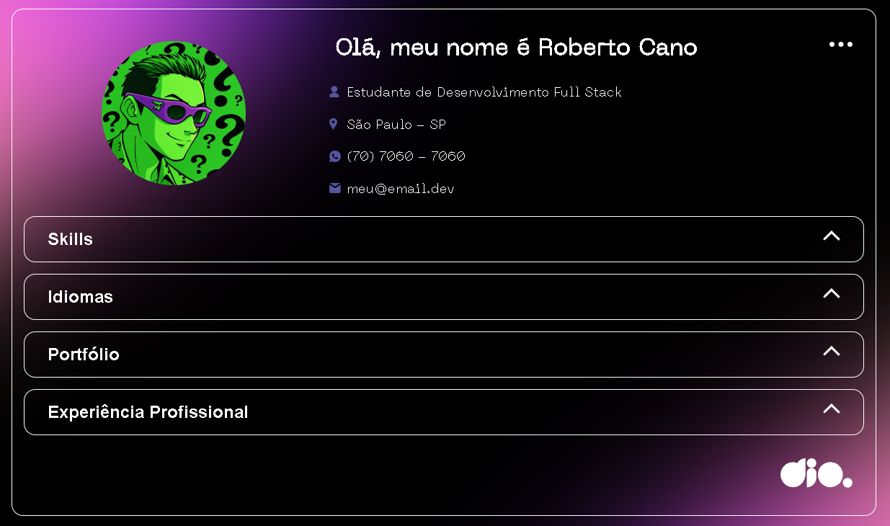
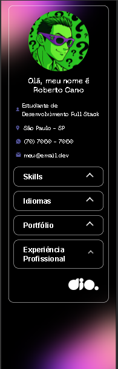

# 🚀 Portfólio Web Interativo com HTML, CSS, JS e JSON

Portfólio dinâmico desenvolvido com JavaScript moderno (ES6+) e CSS modular.  
Todo o conteúdo é carregado a partir de um arquivo JSON (`data/profile.json`) e injetado no HTML via manipulação de DOM.  
O projeto inclui um componente de acordeão acessível, com suporte a teclado e atributos ARIA para melhorar a navegação.

## 📸 Visualização do Projeto

| 💻 Versão Desktop | 📱 Versão Mobile |
| :---: | :---: |
| [](https://robcan0.github.io/js-developer-portfolio/) | [](https://robcan0.github.io/js-developer-portfolio/) |

## 🛠️ Tecnologias

- **HTML5**: estrutura semântica, idioma `pt-BR`, metadados e foco em acessibilidade.  
- **CSS3**: estilos modularizados por seção, variáveis CSS e responsividade com breakpoints (ex.: 768px e 1200px).  
- **JavaScript (ES6+)**: manipulação de DOM, funções assíncronas (`async/await`), métodos de array (`map`, `join`) e criação dinâmica de elementos.  
- **JSON**: “banco de dados” local (`data/profile.json`) para armazenar nome, links, skills, idiomas, projetos e experiências.  

---

## ✨ Funcionalidades

- **Carregamento assíncrono de dados** via `fetch()` a partir de `data/profile.json` (requer servidor local).  
- **Injeção dinâmica de conteúdo**: título da página, foto, contatos, skills, idiomas, portfólio e experiências são atualizados automaticamente via JavaScript.  
- **Acordeão customizado com acessibilidade**: uso de `aria-expanded` e `aria-controls`, IDs dinâmicos para conteúdo e suporte a teclado (Enter/Espaço).  
- **Tratamento de erros**: área de mensagem com `role="alert"` e `aria-live="polite` para anunciar falhas de carregamento.  
- **Responsividade total**: layout adaptável para dispositivos móveis, tablets e desktops.  

---

## 📂 Estrutura do Projeto

```plaintext
├── assets/
│   ├── css/
│   │   ├── global.css
│   │   ├── header.css
│   │   ├── accordion.css
│   │   ├── languages.css
│   │   ├── portfolio.css
│   │   ├── experience.css
│   │   ├── skills.css
│   │   └── footer.css
│   └── js/
│       ├── accordion.js
│       ├── api.js
│       └── main.js
├── data/
│   └── profile.json
└── index.html
```

> Os scripts são carregados no `index.html` nesta ordem: `accordion.js`, `api.js`, `main.js`.

---

## 🚀 Como Executar

### Opção 1 — VS Code (Live Server)
- Clique em **Go Live** para rodar o projeto.  

### Opção 2 — Python
```bash
python -m http.server 8000
```
Acesse: `http://localhost:8000`

### Opção 3 — Node.js (http-server)
```bash
http-server
```
Acesse: `http://localhost:8080`

---

## 🎨 Personalização

Para editar o conteúdo do portfólio, basta modificar o arquivo `data/profile.json`.  
Campos disponíveis: nome, foto, cargo, links, habilidades (hard/soft), idiomas, portfólio e experiências.  

A renderização usa IDs fixos no HTML (ex.: `profile-name`, `profile-languages`, `profile-portfolio`) e o JavaScript preenche essas áreas automaticamente.

---

## ♿ Acessibilidade

- Acordeão com `aria-expanded`/`aria-controls` e suporte a teclado (Enter/Espaço).  
- Área de erro com `role="alert"` e `aria-live="polite` para anunciar falhas de carregamento.  
- Estilos de foco visíveis (outline) em links e botões.  
- Respeito à preferência de reduzir movimento (`prefers-reduced-motion: reduce`).  
- Contraste de cores validado para melhor leitura.  

---

## 🙌 Créditos

Este projeto tem como base o conteúdo criado pelo instrutor **Renan Johannsen** na plataforma **Digital Innovation One (DIO)**, expandido e personalizado por mim.

🔗 **Veja o projeto rodando aqui:** [https://robcan0.github.io/js-developer-portfolio/](https://robcan0.github.io/js-developer-portfolio/)
